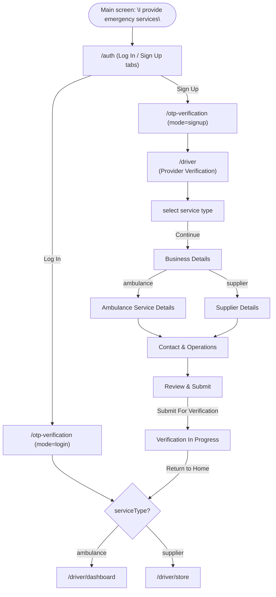

# Driver / Provider Flow

This document describes the provider-side of Lifeline: everything under `app/driver/`. It covers two provider types — **Ambulance Service Provider** and **Medical Supplier / Pharmacy** — which share a registration wizard and then branch into two separate dashboards.

Tapping **"I provide emergency services"** on the main screen (`app/main.tsx`) always goes to `/auth` with `redirectTo=/driver` — same as tapping "I need emergency help" always goes to `/auth` for the requester flow. It never auto-skips based on a stored session; a returning session only matters *after* you pick Log In. The `/auth` screen's **Log In** vs **Sign Up** tabs are the "returning provider" vs "new provider" split: logging in takes you straight to your dashboard, signing up walks you into the Provider Verification / registration wizard.

## 1. High-level flow

## 2. Screens

### Registration wizard (`app/driver/*.tsx`, flat routes)

| Screen | File | Purpose |
|---|---|---|
| Provider Verification | `index.tsx` | Entry gate + service type picker (ambulance vs. supplier) |
| Business Details | `business-details.tsx` | Shared fields for both provider types |
| Ambulance Service Details | `ambulance-details.tsx` | Ambulance-only: type, equipment, vehicle photos |
| Supplier Details | `supplier-details.tsx` | Supplier-only: license, product categories, storage compliance |
| Contact & Operations | `contact-operations.tsx` | Shared: contact person, hours, backup contact |
| Review & Submit | `review-submit.tsx` | Branches its summary card on service type; final submit |
| Verification In Progress | `verification-in-progress.tsx` | Terminal screen after submit; "Return to Home" routes by service type |
| Progress Saved | `progress-saved.tsx` | Built, but **not currently linked** from anywhere — no "save & exit" action exists yet |
| Earnings / Withdraw / Payment Processed | `earnings.tsx`, `withdraw-earnings.tsx`, `payment-processed.tsx` | Reached from the ambulance driver's Profile tab |

**How data flows between wizard screens:** there's no global form state. Each screen reads its incoming values via `useLocalSearchParams`, keeps its own `useState`, and on "Continue" forwards `{ ...params, ...itsOwnFields }` to the next route. This means:
- Every screen also **pre-fills itself** from incoming params, so the "Edit" links on Review & Submit actually restore prior answers instead of resetting the form.
- File pickers (documents, images) are forwarded as JSON-encoded arrays of names/URIs in the params — fine for this in-memory demo, not meant to survive a real upload pipeline.

### Ambulance dashboard (`app/driver/dashboard/`)

A `Tabs` layout (`_layout.tsx`) wrapping `DriverRequestProvider` (`components/DriverRequestContext.tsx`), with 3 tabs:

- `index.tsx` — Home: online/offline toggle, today's earnings, incoming request cards (Accept/Decline).
- `request.tsx` — one screen, three states driven by context `phase`: `detail` → `negotiate` → `active` (trip tracking with ETA, patient contact, arrival).
- `profile.tsx` — driver profile; links to `/driver/earnings` and shared settings routes (`/personal-information`, `/notifications`, etc.).

### Supplier dashboard (`app/driver/store/`)

Two-layer navigator (see §4 for why):
- `_layout.tsx` — a `Stack` holding `StoreProvider` (`components/StoreContext.tsx`).
- `(tabs)/_layout.tsx` — nested `Tabs` with the 3 real tabs: Home (`index.tsx`), Inventory (`inventory.tsx`), Profile (`profile.tsx`).
- Sibling stack screens (not tabs): `add-product.tsx` (add/edit), `product-added.tsx`, `delivery-tracking.tsx`, `delivery-complete.tsx`.

`StoreContext` holds products, new orders, and active orders, with actions (`addProduct`, `acceptOrder`, `declineOrder`, `adjustStock`, `completeDelivery`, …) that both the Home and Inventory tabs read/write.

## 3. Auth & verification gating

Two small services in `services/`, both using `services/storage.ts` (a `Platform.OS === 'web' ? localStorage : SecureStore` shim — **`expo-secure-store` has no web implementation and throws if called directly on web**, which is why this indirection exists):

- `services/auth.ts` — `getToken` / `setToken` / `removeToken`. A session token is set once, at the end of the OTP flow (`src/screens/OtpVerificationScreen.tsx`), only when it was reached via a `redirectTo` param (i.e. from the provider gate, not the ordinary requester signup).
- `services/verification.ts` — `getVerification` / `setVerified` / `clearVerification`. There is **no backend approval step**: a provider becomes "verified" the instant "Submit For Verification" is pressed on Review & Submit. This was a deliberate simplification for this UI-only build.

`OtpVerificationScreen.handleConfirm` branches on `redirectTo` + `mode` once the OTP is confirmed:
1. No `redirectTo` (ordinary requester flow) → unchanged, routes to `/auth` (signup) or `/requester` (login).
2. `redirectTo` present + `mode=login` → sets the token, then always routes straight to a dashboard — Login is treated as an already-registered returning provider, unconditionally, with no picker and no wizard. If a verification record already exists it's used (so the type picked at signup is remembered); if not (e.g. right after "Log Out", or a fresh browser), it defaults to `serviceType: 'ambulance'` and calls `setVerified()` on the spot so the account "becomes" registered, then routes to `/driver/dashboard` or `/driver/store` accordingly.
3. `redirectTo` present + `mode=signup` → sets the token and routes to `redirectTo` (`/driver`), which shows the Provider Verification screen and the registration wizard. This is the only path that ever shows that screen.

`app/driver/index.tsx` no longer has any token/verification check or loading state of its own — it just renders the picker directly. That's intentional: `app/driver/_layout.tsx` already guarantees a session token exists before any `/driver/*` screen renders (see below), and routing someone to a dashboard based on a stored verification record is exclusively Login's job (case 2 above). `/driver` itself always shows the picker, with no "Checking your account…" interstitial and no silent auto-skip — Sign Up (case 3) is the only path that ever reaches it, and it's always a fresh account at that point.

The "Log Out" button on both provider profile screens (`app/driver/dashboard/profile.tsx`, `app/driver/store/(tabs)/profile.tsx`) clears **both** the session token and the verification record (`removeToken` + `clearVerification`), then routes to `/`. This is a full reset rather than a real "log out" — there's no backend account to log back into, so clearing both is what lets you re-test the whole login/signup + registration flow from the main screen.

### Guards against skipping steps

Two layers stop any `/driver/*` URL from being reachable out of sequence (e.g. pasting a wizard URL directly, refreshing mid-form, or navigating back to a stale route):

- **`app/driver/_layout.tsx`** — wraps the entire `/driver` section (the wizard, the ambulance dashboard, and the supplier store). Checks `getToken()` once on mount; shows a spinner while checking, and redirects to `/auth` (`redirectTo=/driver`) if there's no session. Nothing under `/driver/*` renders without a token, whereas previously only `index.tsx` itself checked this.
- **`components/useWizardGuard.ts`** — a small hook (`useWizardGuard(stepComplete: boolean)`) used by each wizard screen after `business-details.tsx`. It redirects to `/driver` if the param that the *previous* step should have forwarded is missing, and the screen returns `null` until the redirect fires (avoiding a flash of an empty form). Since every screen forwards `{ ...params, ...itsOwnFields }`, checking for one field from the prior step is enough to prove the sequence was followed:
  - `business-details.tsx` requires `params.serviceType` (set by the Provider Verification picker).
  - `ambulance-details.tsx` / `supplier-details.tsx` / `contact-operations.tsx` / `review-submit.tsx` require `params.businessName` (set by Business Details).
  - `verification-in-progress.tsx` requires `params.serviceType` (the only param Review & Submit forwards to it).

### Wizard screen layout pattern

`business-details.tsx`, `ambulance-details.tsx`, `supplier-details.tsx`, `contact-operations.tsx`, and `review-submit.tsx` all share the same three-part layout, matching the pattern first established on the Provider Verification picker (`index.tsx`):

- A **sticky header** (back button + title + subtitle) rendered outside the `ScrollView`, with `paddingTop: insets.top + 12` and a bottom border — stays fixed while the form content scrolls underneath it, and clears the device's camera/notch cutout.
- A **pinned footer** (Continue/Submit + Back) rendered after the `ScrollView`, with `paddingBottom: insets.bottom + 16` and a top border — always visible above the keyboard and the device's gesture/nav bar, rather than being the last item you'd otherwise have to scroll to.
- The four screens with text inputs additionally wrap the `ScrollView` + footer in a `KeyboardAvoidingView` (`behavior="padding"` on iOS, default on Android), and chain every single-line field's `returnKeyType="next"` + `onSubmitEditing` to `.focus()` the next field's ref (`blurOnSubmit={false}` so focus doesn't drop in between) — so filling the form is keyboard-driven end to end, ending each screen's chain on `returnKeyType="done"`. Multiline fields (e.g. Service Coverage Area) are a natural break in the chain since a multiline return just inserts a newline.

## 4. Why the Store section has two layout files

Early on, the 4 non-tab Store screens (`add-product`, `product-added`, `delivery-tracking`, `delivery-complete`) were registered directly as `Tabs.Screen` entries with `href: null` to hide them from the tab bar, plus a custom `tabBarStyle.display === 'none'` check in `CustomTabBar`. That worked but was fragile and "felt clumsy" — 7 screens registered on one Tabs navigator when only 3 are real tabs.

It was restructured into the pattern above: a `Stack` for the whole `store/` section, with a nested `Tabs` group (`(tabs)/`) containing only the 3 real tabs. Route paths didn't change — `(tabs)` is a route group, invisible in the URL — but `CustomTabBar` no longer needs any special-casing, and pushed screens naturally don't show a tab bar (rather than needing to be told to hide it).

## 5. Shared UI primitives (`components/`)

Added during a polish pass; used throughout `app/driver/**`:

- `AnimatedPressable.tsx` — drop-in `Pressable` replacement: spring scale-down on press + a light haptic (`expo-haptics`, guarded to skip on web where haptics aren't supported).
- `FadeSlideIn.tsx` — wraps a screen's root (or a list item) to fade + slide it in on mount. Takes an optional `delay` for staggering lists (request cards, order cards, inventory rows).
- `SuccessPop.tsx` — wraps a checkmark/icon on confirmation screens (Verification In Progress, Payment Processed, Product Added, Delivery Complete, Progress Saved) with a spring "pop" on mount.
- `CustomTabBar.tsx` — shared by the requester, ambulance-dashboard, and supplier-dashboard tab bars; active tab pill now springs in and triggers a haptic on switch.

## 6. Known gaps / things a future pass should address

- `progress-saved.tsx` has no entry point — nothing currently offers a "save and finish later" action.
- Uploaded documents/photos only round-trip as names/URIs through route params; there's no real file storage or upload.
- `services/auth.ts`'s token is a literal string `'demo-token'` — there is no real backend authentication.
- Mock data (dashboard requests, store orders/products) is seeded once per provider `Context` and resets on a full reload; nothing persists across sessions except the auth token and verification record.
